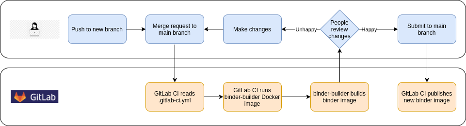

Fast-loading cached binder: 
Default binder: 

# CI status

# Molecular Dynamics Introduction Tutorial

This repository hosts published tutorials for performing molecular dynamics
simulation of a small protein in water solution in GROMACS.

## Usage

1. Click on one of the above "launch binder" buttons and wait for a server to
   be provisioned.
2. Enjoy learning with the tutorial!

If you want to use the Jupyter notebook outside of a binder, see the usage instructions found at https://gitlab.com/gromacs/online-tutorials/website.

## Contributing

Contributions are welcome.
Please open an issue on GitLab to discuss, or make a pull request.

## Making and testing changes

Changes are made via GitLab branches from which merge requests are made to the main branch.
Review of the work in progress is integral, and [GitLab CI][ci] builds binder images corresponding to the branch.
These can be accessed from the GitLab Container Registry for this project at https://gitlab.com/gromacs/online-tutorials/umbrella-sampling/container_registry/1697718.
Alternatively, follow the links from the `README.md` file for the branch.
Once reviewed, the changes in the merge request are submitted and the updated binder images built.

Because this workflow uses Docker, we need to ensure that the GitLab Runner that runs it enables Docker support.
That is available in the general-usage shared GitLab Runner supplied by GitLab, but is not available in
the GitLab Runner supplied by the tcblab Kubernetes cluster to the top-level gromacs group.
So if CI pipelines fail because Docker is unavailable, go to Settings -> CI/CD -> Runners and make sure
that shared runners are enabled and group runners are disabled.

## Project structure

The tutorial content is maintained as a Jupyter notebook running Python.
Its Python dependencies are expressed in the `environment.yml` file.
We want the notebook to run by itself and also as a binder.

When run by itself, the `environment.yml` file is enough to build a conda environment that can run it.
Instructions for users to do that are provided by the webpages built from https://gitlab.com/gromacs/online-tutorials/website.

When run as a binder, both we and [mybinder.org] use [repo2docker] to convert the contents of a repository checkout to a container.
We support the default mode for [mybinder.org], which is to build the container upon startup following the `environment.yml` file found in the default branch.
This can take several minutes or longer.

We also want to let binder users have fast startup by providing [mybinder.org] with a pre-built container.
We can do this via the `binder-cache` branch, that contains just the necessary `Dockerfile`.
That `Dockerfile` pulls an image that is made automatically from the `main` branch by GitLab CI.
GitLab CI's `.gitlab-ci.yml` file calls [repo2docker] to build a container image like [mybinder.org] would do.
That image is pushed to the GitLab Container registry for this GitLab project: https://gitlab.com/gromacs/online-tutorials/umbrella-sampling/container_registry.
When the user clicks on the "fast-loading cached binder" link above, the `Dockerfile` in the `binder-cache` branch directs [mybinder.org] to pull the latest container image.
This provides the same content, but starts the binder faster.

## License

See the LICENSE file.

[repo2docker]: https://repo2docker.readthedocs.io/en/latest/
[mybinder.org]: https://mybinder.org/
